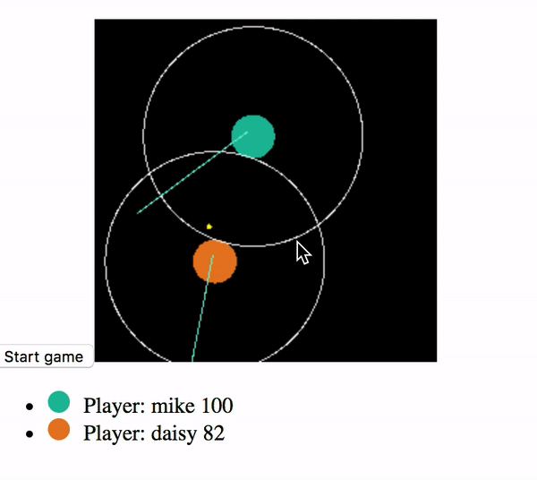

# About

Framework to build bots for [PiwPew](https://www.piwpew.com)



## Installation

```bash
npm install piwpew-bot
```

## Game

[PiwPew](https://www.piwpew.com) is a game where bots, coded by you and others, fight against each other. The game dynamics are quite simple:

1. Your bot registers in the game. This is automatically done for you by the framework.
2. The game engine notifies the bot when the game starts.
3. Your bot sends requests to the game engine. Requests can be: move forward, move backward, shoot, etc.
4. The game engine takes all the requests received from the different players in one tick, evaluates the requests with the current game state and sends the appropiate responses and notifications.
5. Your bot receives responses and notifications and decides what to do next.

Steps 1 and 2 happen only once per game. 3, 4 and 5 repeat until the game ends or your bot is destroyed.

### Game protocol

Bots interact with the game engine by sending [requests](https://github.com/madtrick/piwpew-docs/blob/master/README.md#requests). The game engine validates the requests, executes them and updates its internal state. If the request was successful the response includes data that describes how the bot state changed as a consequence of it. Responses are sent at the end of each [game tick](https://github.com/madtrick/piwpew-docs/blob/master/README.md#game-ticks).

Bots can only have one in-flight request per game tick. That is, they shouldn't send a request before receiving the [notification that signals a new tick](https://github.com/madtrick/piwpew-docs#tick), as later requests will overwrite previous ones.

The game engine sends [notifications](https://github.com/madtrick/piwpew-docs/blob/master/README.md#notifications) to bots in response to game events that happen asynchronously to requests.

Check out the [piwpew-docs](https://github.com/madtrick/piwpew-docs) for a reference documentation about requests and notifications.

## Writing a bot

To write a bot all you have to do is implement the parts you want from the following interface. The methods in the interface map to the request's responses and notifications sent by the game engine.

```typescript
interface BotAPI<S> {
  initState?: () => S

  handlers: {
    radarScanNotification?: (
      data: RadarScanNotification,
      state: S
    ) => { state: S }

    registerPlayerResponse?: (
      data: SuccessfulRegisterPlayerResponse | FailedRegisterPlayerResponse,
      state: S
    ) => { state: S }

    rotatePlayerResponse?: (
      data: SuccessfulRotatePlayerResponse | FailedRotatePlayerResponse,
      state: S
    ) => { state: S }

    movePlayerResponse?: (
      data: SuccessfulMovePlayerResponse | FailedMovePlayerResponse,
      state: S
    ) => { state: S }

    shootResponse?: (
      data: SuccessfulShootResponse | FailedShootResponse,
      state: S
    ) => { state: S }

    deployMineResponse?: (
      data: SuccessfulDeployMineResponse | FailedDeployMineResponse,
      state: S
    ) => { state: S }

    hitNotification?: (
      data: PlayerHitNotification,
      state: S
    ) => { state: S }

    tickNotification?: (
      state: S
    ) => { state: S, request?: Request }

    startGameNotification?: (
      state: S
    ) => { state: S }

    joinGameNotification?: (
      data: JoinGameNotification,
      state: S
    ) => { state: S }
  }
}

```

For a list of all the types mentioned in this interface check: [types](./src/types.ts) and [requests](./src/requests.ts). The npm package exports the required type definitions to build a bot in TypeScript.

Notice that you can only return a request to be sent to the server from the `tickNotification` handler.

### Helpers

The library includes some helpers that can facilitate writing a bot. These helpers are:

```typescript
declare function radiansToDegrees (radians: number): number
```

`radiansToDegrees` converts a angle in radians to its value in degrees

```typescript
declare function calculateAngleBetweenPoints (pointA: Position, pointB: Position): number
```

`calculateAngleBetweenPoints` calculates the angle between two points. The returned value is an angle in degrees.

```typescript
declare function calculateDistanceBetweenTwoPoints (pointA: Position, pointB: Position): number
```

`calculateDistanceBetweenTwoPoints` return the distance between two points in the arena.

The helpers can be imported directly from the library. For example:

```typescript
import { calculateAngleBetweenPoints } from 'piwpew-bot'
```

### Bot registration

You don't have to take care of registering the bot in the game, the library will take care of doing that for you.

### Bot state

Each handler method takes as an argument the bot state that you can use to keep information between handler invocations.  Each handler method must return the new state that will be passed in as an argument to the next handler invocation. You can init the state before receiving any message from the game engine by implementing the `initState` method. The default bot state is an empty object `{}`.

## Usage

Use the `piwpew-bot` tool to run a bot writen with this framework. It works for bots written both in JavaScript or TypeScript.

```shell
$ piwpew-bot -h
Options:
  --help        Show help                                              [boolean]
  --version     Show version number                                    [boolean]
  -i, --id      Bot id                                       [string] [required]
  -m, --module  Module implementing the BotAPI               [string] [required]
  -r, --replay  Log file to be replayed                                 [string]
  -s, --server  Address of the game engine
                                     [string] [default: "wss://game.piwpew.com"]

```

The framework will write a log file with all the messages sent and received by the bot. The log file will be named `<bot-id>-messages.log`.

## Logs playback

If you want to you can replay the logs by running `bin/bot` with the `-r` flag. When replaying the logs, you can pause the playback (for example because you want to set a breakpoint) by adding a line with the text `[break]` in the log file being replayed with `-r`.

## Examples

This repo contains several example bots in the folder `examples/`

## License

MIT

